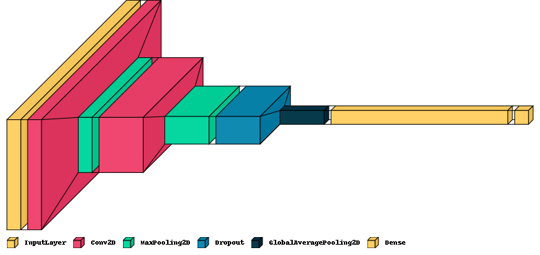
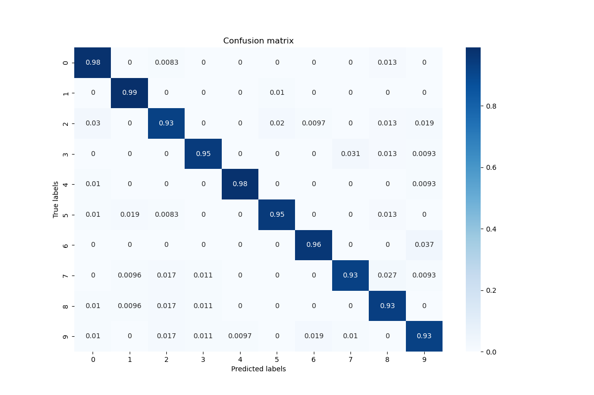
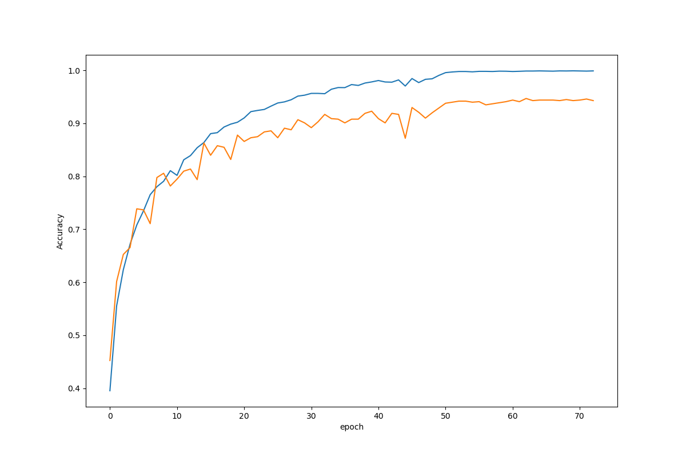

# music-genre-classification

This repository provides a basic approach for predicting the music genre from WAV files. This is done using a deep convolutional network trained on the well-known GTZAN dataset.

A Flask application and a minimal Dash web application run a simple test for prediction, on jazz, reggae and metal musics. The prediction is done in real-time when playing the musics.

## Current model

The current model is a two-block convolutional model : two 2D convolutional layers followed by a max-pooling, a 20% dropout layer, a global average pooling layer and a 512 dense layer. The convolutional blocks have respectivelly 32 and 128 channels.

The model is trained on the spectrogram images given by sequences of 3 seconds of music.

## Model performances

**Confusion matrix on a test set**

**Model error during the training**

